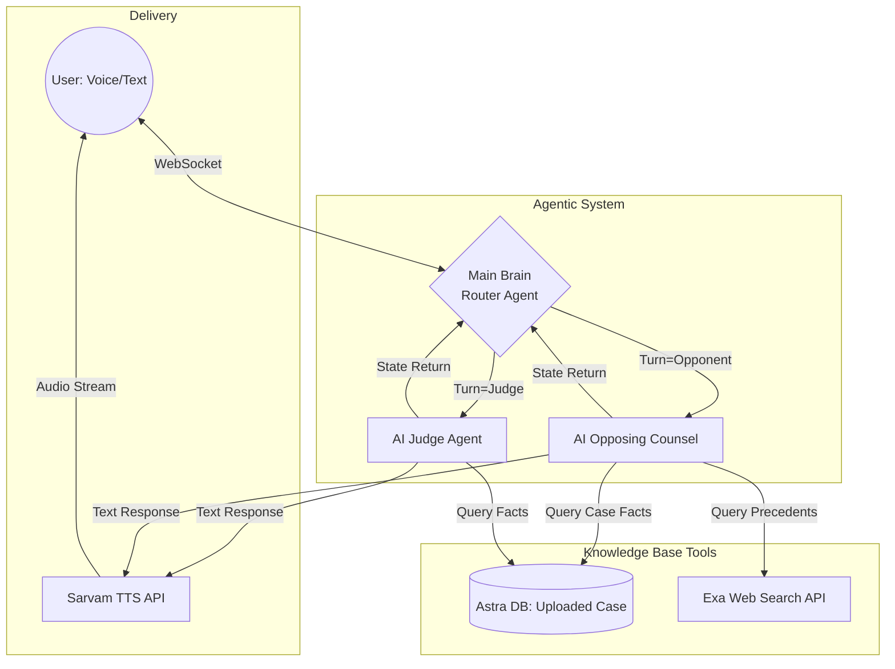

# AI Courtroom Simulator
### A Virtual Litigation & Advocacy Platform
**Team: Caffeine Coders**

---

## 1. Problem Statement

The journey from a law student to a confident litigator is steep. Students and junior lawyers lack access to **realistic, practical, and risk-free environments** to practice litigation, argumentation, and courtroom procedures. 

**The Core Issues:**
- **Theoretical Heavy:** Indian legal education is heavily theory-based (rote learning). Practical application is rare.
- **Resource-Heavy Mock Trials:** Traditional moot courts require physical infrastructure, judges, opposing teams, and immense scheduling effort.
- **High Pressure, Low Feedback:** Making mistakes in a real courtroom can cost a client their case. There is no "sandbox" to fail safely and get objective, instantaneous feedback.

**The Gap:** There is no accessible, on-demand platform to consistently train verbal argumentation, rapid-fire critical thinking, and emotional resilience under pressure.

---

## 2. Our Solution: Agentic AI + Gamified Learning

We built an **immersive, real-time 3D courtroom simulator** where users argue cases against autonomous AI opposing counsel and are presided over by an impartial AI Judge.

**Why our approach works:**
- **Agentic AI:** Unlike standard chatbots, our agents have distinct personas, goals, and the ability to dynamically counter-argue based on the user's specific statements.
- **Gamified Immersion:** A first-person 3D environment, real-time voice interactions, and a clear win/loss condition keep user retention and engagement incredibly high.
- **On-Demand Mentorship:** Practice at 2 AM or 2 PM. Get immediate tactical suggestions during the trial and a comprehensive performance report afterward.

---

## 3. Features & Workflow

**The User Workflow:**
1. **Role Selection:** Choose to play as the Prosecutor or Defender.
2. **Case Initialization:** Upload a case brief (PDF/Text) or type out the case facts. 
3. **The Trial:** Enter the 3D courtroom. The AI Judge announces the case, and the trial begins. Argue using your microphone.
4. **Verdict & Report:** Once the trial concludes, receive the Judge's final verdict and a detailed analytics report on your performance.

**Key Platform Features:**
- **Voice-First Interaction:** Powered by **Sarvam AI** for natural, localized Text-to-Speech (TTS) and seamless browser speech recognition.
- **Interactive 3D Environment:** Built with WebGL for a lightweight yet immersive visual experience (no VR headset required).
- **Live AI Legal Co-Pilot:** Stuck during an argument? Click "Suggest" to get 3 strategic hints based on the current context.
- **RAG & Live Citations:** The AI actively references your uploaded case documents (RAG) and searches the web (**Exa API**) to cite real legal precedents.

---

## 4. Frontend Tech Stack

Our frontend is designed to be highly accessible on standard laptops without requiring high-end GPUs.

- **Framework:** React, Vite, TypeScript (Fast, type-safe, and modular).
- **3D Rendering:** React Three Fiber, Drei (Brings Three.js/WebGL to React for the 3D courtroom and character avatars).
- **Styling & UI:** Tailwind CSS, Shadcn UI (For a clean, modern, and responsive heads-up display).
- **State Management:** Zustand (Handles complex trial state, websocket message queues, and 3D UI synchronization without lag).
- **Audio Pipeline:** Browser Speech API (Mic input) + Sarvam API integration for streaming AI voice responses.

---

## 5. Backend Tech Stack & Agentic Architecture

Our backend relies on a multi-agent system where a central "Main Brain" orchestrates the flow, ensuring no agent speaks out of turn.

**Tech Stack:**
- **Framework:** FastAPI, Python (High performance, async WebSocket support).
- **AI Orchestration:** LangChain & LangGraph (For stateful, multi-agent workflows).
- **LLM:** GitHub Models / Azure Inference (High-speed, cost-effective reasoning).
- **Vector Store:** Astra DB (For RAG document chunking, embedding, and conversation checkpointing).
- **Tools:** Exa Web Search (Live precedents), Sarvam AI (TTS).

### Architecture Workflow Diagram
*(Below is a Mermaid chart illustrating the "Main Brain" orchestration)*

**How it works:**
1. The user speaks.
2. The **Main Brain** evaluates the context and decides who must reply (Judge or Opposing Counsel).
3. The selected **Agent** uses RAG (to check the uploaded case) and Web Search (to find citations) to formulate a response.
4. The response is sent to **Sarvam TTS**, generating audio that streams back to the user's 3D courtroom.
5. The loop returns to the Main Brain.

---

## 6. Business Angle

**Target Audience:**
- **Primary:** Law Students across India's thousands of law colleges.
- **Secondary:** Junior Lawyers, Corporate Legal Trainees, and Legal Training Institutes.

**Business Model:**
- **B2C Freemium:** Individual students sign up for free (access to basic, pre-loaded cases). Premium subscription unlocks unlimited custom case uploads, advanced analytics, and priority voice generation.
- **B2B Institutional Licensing:** Law schools purchase enterprise licenses to integrate the simulator into their moot court curriculum. Includes a Professor Dashboard to track cohort performance, assign cases, and grade students objectively.

**Mass Reach & Feasibility:**
- **Highly Accessible:** Runs entirely in the web browser. No heavy downloads or expensive hardware needed.
- **Scalable Costs:** Using efficient LLM routing, RAG (only retrieving when necessary), and localized TTS keeps the cost-per-trial extremely low, allowing for scalable profit margins.

---

## 7. Future Scope

To make the AI Courtroom an indispensable tool for the Indian legal sector, our roadmap includes:

- **Fine-Tuned Legal LLMs:** Training models specifically on the new Indian penal codes (Bharatiya Nyaya Sanhita, BNSS, BSA) and millions of historical Supreme Court judgments to provide hyper-accurate legal reasoning.
- **Hyper-Accurate Citations:** Deep integration with Indian legal databases (like SCC Online or Indian Kanoon) for citing exact sections, clauses, and sub-sections in real-time.
- **Advanced Scoring System:** Upgrading the end-of-trial report to evaluate specific metrics: emotional composure, objection timing, logical fallacies, and confidence levels using voice tone analysis.
- **Multiplayer / PvP Mode:** Human vs. Human trials (two students arguing against each other) while the AI strictly plays the role of the impartial Judge and scorer.
- **VR Integration:** Transitioning the WebGL 3D environment into full WebXR for immersive Virtual Reality training.
